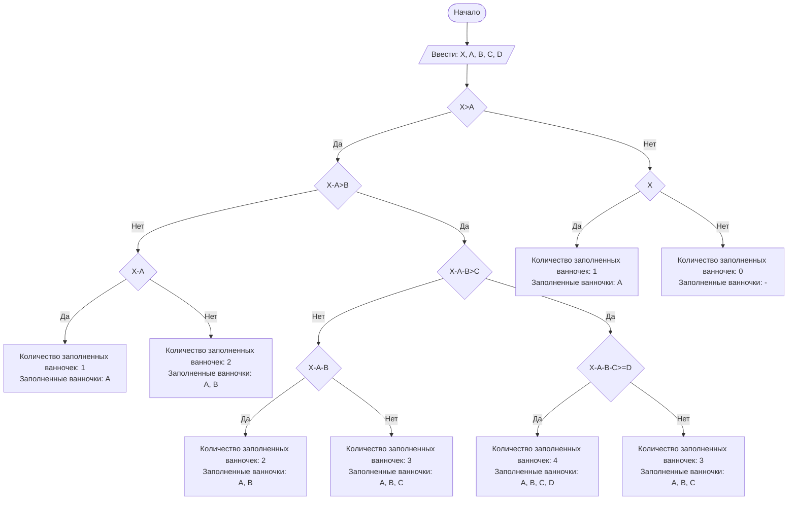

# Отчет по лабораторной работе № 1

#### № группы: `ПМ-2402`

#### Выполнил: `Малышев Денис Валерьевич`

#### Вариант: `16`

### Cодержание:

- [Постановка задачи](#1-постановка-задачи)
- [Входные и выходные данные](#2-входные-и-выходные-данные)
- [Выбор структуры данных](#3-выбор-структуры-данных)
- [Алгоритм](#4-алгоритм)
- [Программа](#5-программа)
- [Анализ правильности решения](#6-анализ-правильности-решения)

### 1. Постановка задачи

> Последовательность из четырех ванночек объемами A, B, C, D литров установлена в указанном порядке ступенькой (объем A — сверху). Ванночки
установлены таким образом, что если в ванночку наливать воду больше её
объема, излишки будут стекать в следующую ванночку, установленную ниже (как каскадный водопад). Изначально все ванночки пусты. В верхнюю
ванночку выливают воду объемом X литров. Какое количество ванночек
окажется в результате полностью заполненным? Какие ванночки окажутся
в результате полностью заполненным? На вход программы подаются натуральные числа X, A, B, C, D

Каждый раз будем сравнивать объем воды, поступаемый в ванночку, с ее собственным объемом. Так как стекать вода будет сверху вниз, начинать будем с ванночки A(она установлена выше всех по условию). Если объем
поступаемой воды больше объема ванночки, то вода стекает в следующую ванну, с которой мы будем проводить те же проверки, что и с предыдущей, а рассматриваемая ванна будет идти в общий счет заполненных. Если
объем воды равен объему ванночки, то вода стекать дальше не будет, и на этом счет количества заполненных ваночек можно прекращать, однако рассматриваемая ванночка будем входить в итоговое число заполненных. Если
объем ванночки больше объема воды, поступаемой в нее, в таком случае можно заканчивать счет заполненных ванночек, но рассматриваемую ванну считать не будем.

### 2. Входные и выходные данные

#### Данные на вход

На вход программа должна получать 5 чисел, по условию сказано только то, что они должны быть натуральными. В данной задаче не играет роли какие числа будут выбраны, поэтому возьмем натуральные числа, не 
превышающие 1000. Этого нам хватит, чтобы проверить все возможные случаи.

|             | Тип               | min значение    | max значение   |
|-------------|-------------------|-----------------|----------------|
| X (Объем воды, подаваемый в ванночку A ) | Натуральное число |        1        |      1000      |
| A (Объем 1 ванночки) | Натуральное число |        1        |      1000      |
| B (Объем 2 ванночки) | Натуральное число |        1        |      1000      |
| C (Объем 3 ванночки) | Натуральное число |        1        |      1000      |
| D (Объем 4 ванночки) | Натуральное число |        1        |      1000      |

#### Данные на выход

На выходе две строки, содержащие в себе только символы. В первой строке будет выведено количество заполненных ванночек, во второй- какие это ванночки.

|         | Тип                                |
|---------|------------------------------------|
| Количество заполненных ванночек | Строка |
| Что это за ванночки | Строка |

### 3. Выбор структуры данных

Для моей работы необязательно выделять отдельные переменные для хранения данных.

### 4. Алгоритм

#### Алгоритм выполнения программы:

1. **Ввод данных:**  
   Программа считывает пять натуральных чисел, обозначенные как `X`, `A`, `B`, `C` и `D`.

2. **Проверка условий:**  
   Программа сравнивает объем ванны и объем подаваемой в нее воду:
   - **если объем воды больше, ванна идет в счет заполненных и программа рассматривает следующую ванну**
   - **если объем воды равен объему ванны, то она идет в счет заполненных, а последующие ванны не рассматриваются, тк стекать больше нечему**
   - **если объем воды меньше объема ванны, то значит она заполнена не полностью и последующие ванны не рассматриваются, а данная не идет в счет**

4. **Вывод результата:**  
   Программа выводит в первой строке количество заполненных полностью ванночек, в следующей строке- какие это ванночки.

#### Блок-схема



### 5. Программа

```java
import java.util.Scanner;
public class Main {
    // Объявлем объект класса Scanner для ввода данных
    public static Scanner in = new Scanner(System.in);
    public static void main(String[] args) {
        int X=in.nextInt(); //вводим объем воды вливаемы в ванну A
        int A=in.nextInt(); //вводим объем ванны A
        int B=in.nextInt(); //вводим объем ванны B
        int C=in.nextInt(); //вводим объем ванны C
        int D=in.nextInt(); //вводим объем ванны D
        if (A<X) { //случай когда объем ванны А меньше объема вливаемой в нее воды
            if ( B<(X-A) ){ //случай когда объем ванны B меньше объема вливаемой в нее воды
                if ( C<((X-A)-B) ){ //случай когда объем ванны C меньше объема вливаемой в нее воды
                    if ( D<=(((X-A)-B)-C) ){ //случай когда объем ванны D меньше или равен объему вливаемой в нее воды
                        System.out.println("Количество заполненных ванночек: 4");
                        System.out.print("Заполненные ванночки: A, B, C, D");
                    }
                    else { //случай когда объем ванны D больше объема вливаемой в нее воды
                        System.out.println("Количество заполненных ванночек: 3");
                        System.out.print("Заполненные ванночки: A, B, C");
                    }
                }
                else { //случай когда объем ванны С не маеньше объема вливаемой в неё воды
                    if (C>((X-A)-B)){ //случай когда объем ванны С больше объема вливаемой в нее воды
                        System.out.println("Количество заполненных ванночек: 2");
                        System.out.print("Заполненные ванночки: A, B");
                    }
                    else {  //случай когда объем ванны С равен объему вливаемой в нее воды
                        System.out.println("Количество заполненных ванночек: 3");
                        System.out.print("Заполненные ванночки: A, B, C");
                    }
                }
            }
            else { //случай когда объем ванны B не меньше объема вливаемой в нее воды
                if ((X-A)==B){ //случай когда объем ванны B равен объему вливаемой в нее воды
                    System.out.println("Количество заполненных ванночек: 2");
                    System.out.print("Заполненные ванночки: A, B");
                }
                else { //случай когда объем ванны B больше объема вливаемой в нее воды
                    System.out.println("Количество заполненных ванночек: 1");
                    System.out.print("Заполненные ванночки: A");
                }
            }
        }
        else { //случай когда объем ванны A не меньше объема вливаемой в нее воды
            if (X==A){ //случай когда объем ванны A равен объему вливаемой в неё воды
                System.out.println("Количество заполненных ванночек: 1");
                System.out.print("Заполненные ванночки: A");
            }
            else { //случай когда объем ванны A больше объема вливаемой в неё воды
                System.out.println("Количество заполненных ванночек: 0");
                System.out.print("Заполненные ванночки: -");
            }
        }
    }
}
```

### 6. Анализ правильности решения

Программа работает корректно для любых заданных натуральных чисел и при любых условиях их задачи.

1. Тест если вода протекла через все ванночки и вытекла из последней:

    - **Input**:
        ```
        100 1 2 3 4
        ```

    - **Output**:
        ```
        Количество заполненных ванночек: 4
        Заполненные ванночки: A, B, C, D
        ```

2. Тест если вода заполнила только первую ванну:

    - **Input**:
        ```
        50 48 4 5 6
        ```

    - **Output**:
        ```
        Количество заполненных ванночек: 1
        Заполненные ванночки: A
        ```

3. Тест если вода не заполнила ни одну ванночку:

    - **Input**:
        ```
        3 6 7 8 9
        ```

    - **Output**:
        ```
        Количество заполненных ванночек: 0
        Заполненные ванночки: -
        ```

4. Тест если вода заполнила 2 ванночки:

    - **Input**:
        ```
        50 20 30 1 2
        ```

    - **Output**:
        ```
        Количество заполненных ванночек: 2
        Заполненные ванночки: A, B
        ```

5. Тест если вода заполнила 3 ванночки и не полностью наберет четвертую:

    - **Input**:
        ```
         100 20 30 48 5
        ```

    - **Output**:
        ```
        Количество заполненных ванночек: 3
        Заполненные ванночки: A, B, C
        ```
